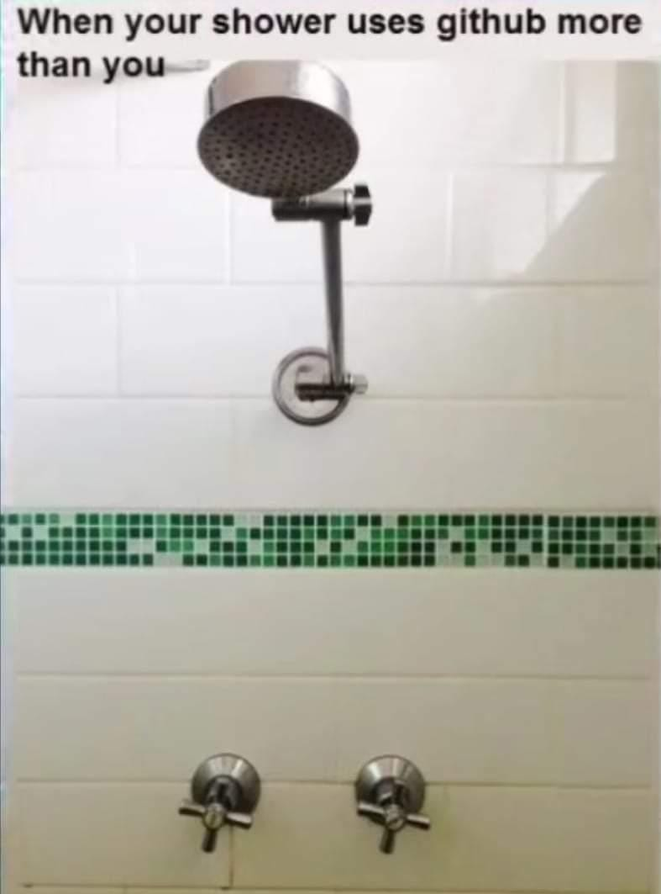

<h1 align="center">Hi, I am Arthur :wave:</h1>

 

:deciduous_tree: I am currently studying at the very Facultad de Ingenieria

<h2 align="center"> :tulip: About me :tulip: </h2>

:star: I´m studyind Computer Engineering

<h3 align="center">I am... </h2>

:star2: A pre-inter at PROTECO

:penguin: A linux user

:star: A ver good pana

:guitar: Guitarist

:star: A capybara lover

 
<h2 align="center"> :green_book: Current technologies that I'm learning :pencil2:</h2>

     

<h2> :sparkling_heart: Goals :sparkles:</h2>
<ul type="square">
  <li>Becoming a Cybersecurity Engineer :computer:</li>
  <li>Be a great teacher :pencil:</li>
  <li>Someday, live in Canada:snowflake:</li>
  <li>Live with my pretty GF :yellow_heart:</li>
  <li>Petting a capybara and an Axolotl :revolving_hearts:</li>
</ul>
 

<h1 align="center"> :heart: See you later :wave:</h1>

