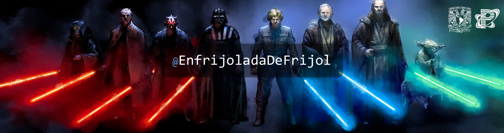

<samp>
</img>

  <table align="right">
  <tr><td><a href="https://github.com/EnfrijoladaDeFrijol"> English</a></td></tr>
  <tr><td><a href="https://github.com/EnfrijoladaDeFrijol/EnfrijoladaDeFrijol/blob/master/README-esp.md">  Español</a></td></tr>
  </table>

<h1 align="center"> Hello world !</h1>

<!-- Gatitos saludando

-->

  

  

  # :honeybee: About me :honeybee:

<!-- 
</img>

-->

<h3 align="left">I am currently studying Computer Engineering at the very Facultad de Ingenieria (UNAM)</h3>

I've worked hard to get to this point where I feel I can dedicate myself to technology and development, but likewise one of my biggest dreams is to be a good teacher to contribute a grain of sand to this chaotic world.

- 🌱 I am inter at PROTECO. 
- :penguin: I am also a linux user. 
- 🏆 My personal goal, contribute more to open source projects. 
- :guitar: I like playing guitar as a hobby. 
- :hearts: I love capybaras, Neon Genesis Evangelion and my Gf.
- :diamond_shape_with_a_dot_inside: I like rubik cubes.
- :book: I wanna become a great teacher.
- :star2: My biggest dream, becoming a Cybersecurity Engineer.

 
 
 
 

   

<h1 align="center"> :green_book: Knowledge :pencil2:</h1>

     

 

 
  
<h2>:chart_with_upwards_trend: Github Activity Graph</h2>

  

  

 
  
<h2>📊 Github Stats and Activit</h2>

  

  
   
  

<a href="#-hello-world-"> Home</a>

</img>

<!--

-->

